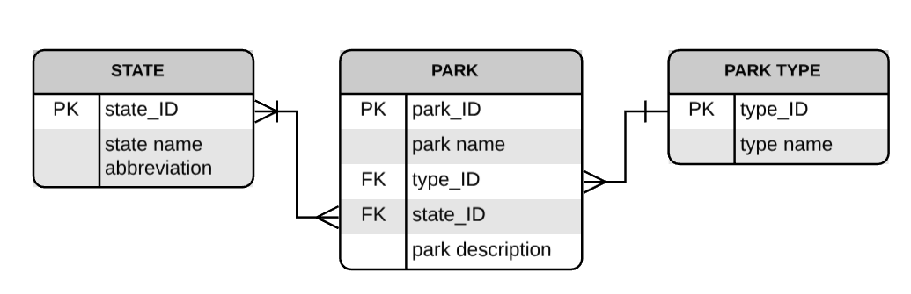

# US National Park Catalog

by Lusi Wang

[Link to this repository](https://github.com/ruthwanglusi/SI507_final)

---

## Project Description

This project presents US National Parks in web browser using Flask. It features two parks at the home page and allows users to filter parks by state and by type. Click on the drop down menu to access a full list of national parks at a chosen state or a chose park type.

Data Source: www.nps.gov

## How to run

1. pip install required modules from requirements.txt
2. run SI507project_tool_app.py

## How to use

1. Open a browser, go to address http://localhost:5000/
2. Select a state in the drop-down list, then click 'submit state' to see all the parks in that state
3. Select a type in the drop-down list, then click 'submit type' to see all the parks of that type
4. Refresh the home page to see two new parks featured

## Routes in this application
- `/` -> drop down menus to select state and type, 2 featured parks
- `/state/(state name)` -> all the national parks in this state
- `/type/(park type)` -> all the national parks of this type

## How to run tests
1. Find the test file SI507project_test.py
2. Run the test file

## In this repository (folder structure):
- SI507project_tool_app.py
- SI507project_tool_scrape.py
- SI507SI507project_tool_pop.py
- SI507project_test.py
- README.md
- requirements.txt
- park_info.db (created by running `create_db()` in SI507project_tool_app.py, currently commented out)
- park_cache.json (created by running SI507project_tool_scrape.py, cache updates every 10 days)
- advanced_expiry_caching.py (helper tool for caching)
- Templates
  - main.html (javascript included)
  - state.html
  - type.html
- Image
  - ERD_diagram.png
  - screen_shots
    - home-select-state.png
    - state-result.png
    - home-select-type.png
    - type-result.png
    - home.png

## Database diagram:

---
## Code Requirements for Grading
Please check the requirements you have accomplished in your code as demonstrated.
- [x] This is a completed requirement.
- [ ] This is an incomplete requirement.

Below is a list of the requirements listed in the rubric for you to copy and paste.  See rubric on Canvas for more details.

### General
- [X] Project is submitted as a Github repository
- [X] Project includes a working Flask application that runs locally on a computer
- [X] Project includes at least 1 test suite file with reasonable tests in it.
- [X] Includes a `requirements.txt` file containing all required modules to run program
- [X] Includes a clear and readable README.md that follows this template
- [X] Includes a sample .sqlite/.db file
- [X] Includes a diagram of your database schema
- [X] Includes EVERY file needed in order to run the project
- [X] Includes screenshots and/or clear descriptions of what your project should look like when it is working

### Flask Application
- [X] Includes at least 3 different routes
- [X] View/s a user can see when the application runs that are understandable/legible for someone who has NOT taken this course
- [X] Interactions with a database that has at least 2 tables
- [X] At least 1 relationship between 2 tables in database
- [X] Information stored in the database is viewed or interacted with in some way

### Additional Components (at least 6 required)
- [ ] Use of a new module
- [ ] Use of a second new module
- [ ] Object definitions using inheritance (indicate if this counts for 2 or 3 of the six requirements in a parenthetical)
- [X] A many-to-many relationship in your database structure
- [X] At least one form in your Flask application
- [X] Templating in your Flask application
- [X] Inclusion of JavaScript files in the application (in main.html)
- [X] Links in the views of Flask application page/s
- [X] Relevant use of `itertools` and/or `collections` (2 featured parks update upon every reload)
- [ ] Sourcing of data using web scraping
- [ ] Sourcing of data using web REST API requests
- [ ] Sourcing of data using user input and/or a downloaded .csv or .json dataset
- [ ] Caching of data you continually retrieve from the internet in some way

### Submission
- [X] I included a link to my GitHub repository with the correct permissions on Canvas! (Did you though? Did you actually? Are you sure you didn't forget?)
- [X] I included a summary of my project and how I thought it went **in my Canvas submission**!
